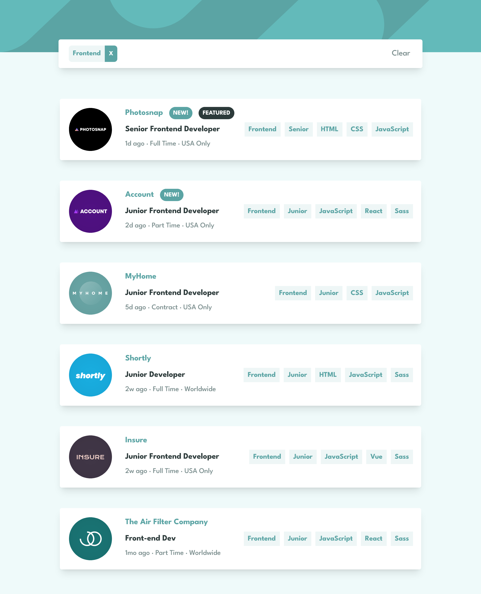
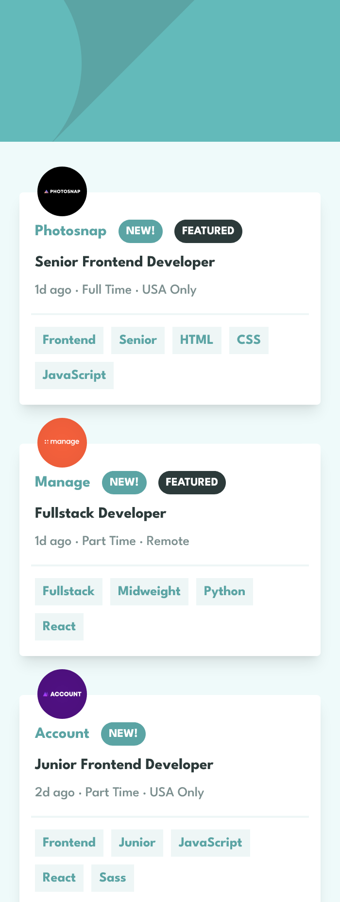

# Frontend Mentor - React Job listings with filtering solution

This is a solution to the [Job listings with filtering challenge on Frontend Mentor](https://www.frontendmentor.io/challenges/job-listings-with-filtering-ivstIPCt). Frontend Mentor challenges help you improve your coding skills by building realistic projects.

## Table of contents

-   [Overview](#overview)
    -   [The challenge](#the-challenge)
    -   [Screenshot](#screenshot)
    -   [Links](#links)
-   [My process](#my-process)
    -   [Built with](#built-with)
    -   [What I learned](#what-i-learned)
    -   [Continued development](#continued-development)
    -   [Useful resources](#useful-resources)
-   [Author](#author)
-   [Acknowledgments](#acknowledgments)

## Overview

### The challenge

The challenge was to build a job listing web application that allows users to filter job listings based on various categories such as job role, level, and languages.

Users should be able to:

-   View the optimal layout for the site depending on their device's screen size
-   See hover states for all interactive elements on the page
-   Filter job listings based on the categories

### Screenshot




### Links

-   Solution URL: [Add solution URL here](https://www.frontendmentor.io/solutions/reacttailwind-css-job-listings-with-filtering--VhD4P8GVH)
-   Live Site URL: [Add live site URL here](https://joblistings-react-tailwind.netlify.app)

## My process

### Built with

-   [React](https://reactjs.org/) - JS library
-   Tailwind CSS
-   Flexbox
-   JSON Data
-   Mobile-first workflow
-   [Vite](https://vitejs.dev/) - react local development

### What I learned

During this project, I learned how to use React to create reusable components and how to filter data based on user input.
I also improved my CSS skills by implementing hover states and using flexbox and CSS grid for layout.

I am really happy with learning new js array method `.every()`, this has made my main filtering function very concise:

```js
const filterJobs = (job) => {
	const tags = [job.role, job.level, ...job.languages, ...job.tools];
	return selectedTags.every((tag) => tags.includes(tag));
};
```

### Continued development

I plan to continue learning React and improving my CSS skills. I also want to learn more about using APIs to fetch data for my projects.

### Useful resources

-   [Official vite docs](https://vitejs.dev/guide/static-deploy.html) - Documentation helped me deploy my react app.

## Author

-   Github profile - [@monte-dev](https://github.com/monte-dev)
-   Frontend Mentor - [@monte-dev](https://www.frontendmentor.io/profile/monte-dev)

## Acknowledgments

I would like to thank Frontend Mentor for providing this challenge and for providing a platform for developers to improve their skills.
